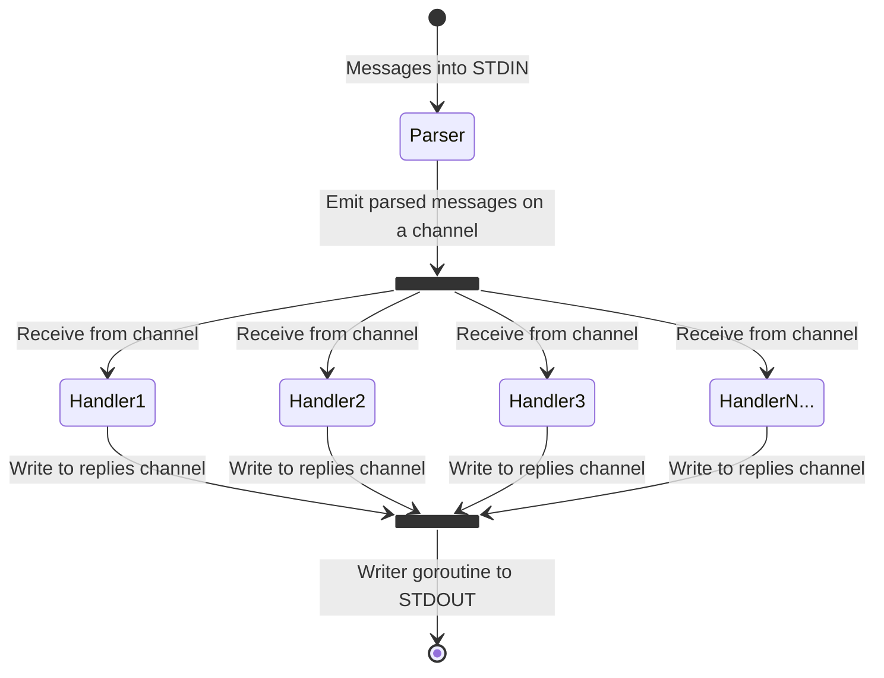

# Flyio

**Solving the [fly.io] [distributed systems challenges] in Go**

## Project Description

This is my take on solutions for the challenges detailed at <https://fly.io/dist-sys>

Although I'm doing it in Go, I've chosen not to use the provided [maelstrom] library to implement the node and messages. There are a few reasons for this:

- Using their library to take care of all the plumbing feels like cheating 😉
- Their Go implementation has a couple of drawbacks:
  - Each message goes through JSON serialisation/deserialisation multiple times on it's way through the Node
  - The code is very sequential, the handlers kick off a few goroutines but it's not what I'd call "concurrent first"
  - Some gaps in error handling, JSON serialisation/deserialisation can fail silently for example, as does writing to stdout
  - The `HandlerFunc` pattern doesn't really work for the Node as you need access to it to call the `node.Reply` method, leading to large closures defined inline rather than tidy handler functions
- Fun
- I have a nice idea for how to handle this concurrently:
  - A reader goroutine reading from stdin, parsing maelstrom messages and putting them on a channel to be handled
  - Multiple goroutines pulling messages off the inbound channel, handling them in parallel, and putting replies on a reply channel
  - A writer goroutine pulling replies from the reply channel and writing them to stdout

## Design

As above, the message handling is split into 3 concurrent concerns:

- Input parsing
- Message handling
- Reply writing

[fly.io]: https://fly.io
[distributed systems challenges]: https://fly.io/dist-sys
[maelstrom]: https://github.com/jepsen-io/maelstrom
